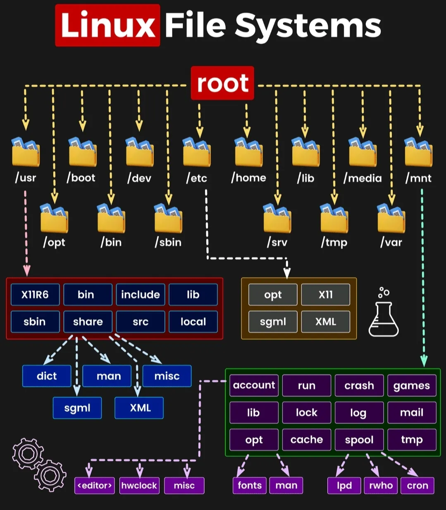

# Linux Command Cheat Sheet

External Resource Page: https://tldr.inbrowser.app/

# Executive Summary

> Master the essentials of Linux with this quick reference guide. It covers file management, process control, system monitoring, networking, and more. Designed for efficiency, this cheat sheet empowers users to navigate and manage Linux systems effectively, whether you're a beginner or a seasoned administrator.
> 

---

# Description

> This cheat sheet is a comprehensive yet concise guide to essential Linux commands, designed to help you navigate and manage Linux systems with ease. Whether you're a beginner just starting your Linux journey or an experienced administrator looking for a quick reference, this guide has you covered.
It includes commands for file and directory management, user permissions, process control, system monitoring, networking, package management, and more. Each section is organized for quick access, ensuring you can find the right command for the task at hand.
Linux commands are powerful tools that unlock the full potential of your system. Use this cheat sheet to streamline your workflow, troubleshoot issues, and perform administrative tasks efficiently. Keep it handy for instant access to the commands you need to become a Linux power user.
> 

---

# Commands

## Bash Shortcuts:

| Operator | Effect |
| --- | --- |
| CTRL-c | Stop current command |
| CTRL-z | Sleep program |
| CTRL-a | Go to start of line |
| CTRL-e | Go to end of line |
| CTRL-u | Cut from start of line |
| CTRL-k | Cut to end of line |
| CTRL-r | Search history |
| TAB | Complete arguments or list all available commands |
| !! | Repeat last command |
| !*abc* | Run last command starting with *abc* |
| !*abc*:p | Print last command starting with *abc* |
| !$ | Last argument of previous command |
| ALT-. | Last argument of previous command |
| !* | All arguments of previous command |
| ^*abc*^*123* | Run previous command, replacing *abc* with *123* |

## System Information:

| Command | Purpose |
| --- | --- |
| uname -a | Display Linux system information |
| uname -r | Display kernel release information |
| lsb_release -a | Display distribution-specific information (Linux Standard Base) |
| cat /etc/os-release | Review the OS build information |
| cat /etc/redhat-release | Show which version of redhat installed |
|  uptime | Show how long the system has been running + load |
| hostname | Show system host name |
| hostname -I | Display the IP addresses of the host |
| last reboot | Show system reboot history |
| date | Show the current date and time |
| cal | Show this month's calendar |
| w | Display who is online |
| whoami | Who you are logged in as |
| systemctl list-units --type=service --all | Review all services installed on Linux |
| sudo apt list --installed | list packages installed Debian systems |
| dpkg --list | list packages installed RedHat systems |

## Hardware Information:

| Command | Purpose |
| --- | --- |
| dmesg | Display messages in kernel ring buffer |
| cat /proc/cpuinfo | Display CPU information |
| cat /proc/meminfo | Display memory information |
| free -h | Display free and used memory ( -h for human readable,-m for MB, -g for GB.) |
| lspci -tv | Display PCI devices |
| lsusb -tv | Display USB devices |
| dmidecode | Display DMI/SMBIOS (hardware info) from the BIOS |
| hdparm -i /dev/sda | Show info about disk sda |
| hdparm -tT /dev/sda | Perform a read speed test on disk sda |
| badblocks -s /dev/sda | Test for unreadable blocks on disk sda |
| df -h | Show free and used space on mounted filesystems |
| df -i | Show free and used inodes on mounted filesystems |
| fdisk -l | Display disks partitions sizes and types |
| du -ah | Display disk usage for all files and directories inhuman readable format |
| du -sh | Display total disk usage off the current directory |

## Performance Monitoring and Statistics:

| Command | Purpose |
| --- | --- |
| top | Display and manage the top processes |
| htop | Interactive process viewer (top alternative) |
| mpstat 1 | Display processor related statistics |
| vmstat 1 | Display virtual memory statistics |
| iostat 1 | Display I/O statistics |
| tail 100 /var/log/messages | Display the last 100 syslog messages (Use/var/log/syslog for Debian based systems.) |
| tcpdump -i eth0 | Capture and display all packets on interface eth0 |
| tcpdump -i eth0 'port 80' | Monitor all traffic on port 80 ( HTTP ) |
| lsof | List all open files on the system |
| lsof -u user | List files opened by user |
| free -h | Display free and used memory ( -h for humanreadable, -m for MB, -g for GB.) |
| watch df -h | Execute "df -h", showing periodic updates |

## User Information and Management:

| Command | Purpose |
| --- | --- |
| id | Display the user and group ids of your current user. |
| last | Display the last users who have logged onto the system. |
| who | Show who is logged into the system. |
| w | Show who is logged in and what they are doing. |
| groupadd Sales | Create a group named "Sales". |
| useradd -c "Jim Helpert" -m jim | Create an account named jim, with a comment of "Jim Helpert" and create the user's home directory. |
| userdel jim | Delete the jim account. |
| usermod -aG Sales jim | Add the jim account to the Sales group |

## Linux file system:



## File and Directory Commands:

| Command | Purpose |
| --- | --- |
| ln -s "Path to binary" name | Create a symbolic link in the environment variable file to call a binary from anywhere. |
| ls -al | List all files in a long listing (detailed) format |
| pwd | Display the present working directory |
| mkdir documents | Create a directory named “documents” |
| rm passwords.txt | Remove (delete) a file named “passwords.txt” |
| rm -r documents | Remove the directory named “documents” and its contents recursively |
| rm -f  passwords.txt | Force removal of file named “passwords.txt” without prompting for confirmation |
| rm -rf documents | Force removal of directory named “documents” recursively without prompting for confirmation |
| cp file1 file2 | Copy file1 to file2 |
| cp -r source_directory destination | Copy source_directory recursively to destination. If destination exists, copy source_directory into destination, otherwise create destination with the contents of source_directory. |
| mv file1 file2 | Rename or move file1 to file2. If file2 is an existing directory, move file1 into directory file2 |
| touch file | Create an empty file or update the access and modification times of file. |
| cat passwords.txt | View the contents of the file “passwords.txt” |
| less passwords.txt | View the contents of the file “passwords.txt” |
| head passwords.txt | Display the first 10 lines of the file “passwords.txt” |
| tail passwords.txt | Display the last 10 lines of the file “passwords.txt” |
| tail -f log.txt | Display the last 10 lines of the file “log.txt” and follows the file as it grows. |
| grep pattern file | Search for pattern in file |
| grep -r pattern directory |  Search recursively for pattern in directory |
| locate name | Find files and directories by name |
| find /home/jim -name 'passwords*' |  Find files in /home/jim that start with "passwords". |
| find /home -size +100M | Find files larger than 100MB in /home |
| cd .. | To go up one level of the directory tree. (Change into the parent directory.) |
| cd | Go to the $HOME directory |
| cd /etc | Change to the /etc directory |

## File Permissions:


| U = User | G = Group | W = World |
| --- | --- | --- |
| r = read | r = read | r = read |
| w = write | w = write | w = write |
| x = execute | x = execute | x = execute |
| • = no access | • = no access | • = no access |

## Archiving (Tar Files):

| Command | Purpose |
| --- | --- |
| tar cf archive.tar directory | Create tar named archive.tar containing directory. |
| tar xf archive.tar | Extract the contents from archive.tar. |
| tar czf archive.tar.gz directory | Create a gzip compressed tar file namearchive.tar.gz. |
| tar xzf archive.tar.gz | Extract a gzip compressed tar file. |
| tar cjf archive.tar.bz2 directory | Create a tar file with bzip2 compression |
| tar xjf archive.tar.bz2 | Extract a bzip2 compressed tar file |
| tar zxvf sourcecode.tar.gzcd sourcecode ./configuremake make install--h | Install software from source code. |

## File transfer:

| Command | Purpose |
| --- | --- |
| scp file.txt server:/tmp | Secure copy file.txt to the /tmp folder on server |
| scp server:/var/www/*.html /tmp | Copy *.html files from server to the local/tmp folder. |
| scp -r server:/var/www /tmp | Copy aall files and directories recursively from server to the current system's /tmp folder. |
| rsync -a /home /backups/ | Synchronize /home to /backups/home |
| rsync -avz /homeserver:/backups/ | Synchronize files/directories between the local and remote system with compression enabled |

## Process Management:

| Command | Purpose |
| --- | --- |
| ps | Display your currently running processes |
| ps -ef | Display all the currently running processes on the system. |
| ps -ef | grep processname | Display process information for process name |
| top | Display and manage the top processes |
| htop |  Interactive process viewer (top alternative) |
| kill 3986 | Kill process with process ID of 3986 |
| kill all bash | Kill all processes named “bash” |
| bash & | Start the program “bash” in the background |
| bg | Display stopped or background jobs |
| fg | Brings the most recent background job to foreground |
| fg n | Brings job n to the foreground |
| ps axo stat,ppid,pid,comm | grep -w defunct | Display all zombie processes |
| sudo kill -9 3988 | kill the defunct process with pid 3988 |

## Networking:

| Command | Purpose |
| --- | --- |
| ifconfig -a | Display all network interfaces and ip address |
| ifconfig eth0 | Display eth0 address and details |
| ethtool eth0 | Query or control network driver and hardware settings |
| ping host | Send ICMP echo request to host |
| whois domain | Display whois information for domain |
| dig domain | Display DNS information for domain |
| dig -x 10.0.0.10 | Reverse lookup of IP Address 10.0.0.10 |
| host domain | Display DNS ip address for domain |
| hostname -i | Display the network address of the host name. |
| hostname -I | Display all local ip addresses |
| wget [http://domain.com/file](http://domain.com/file) | Download [http://domain.com/file](http://domain.com/file) |
| netstat -nutlp | Display listening tcp and udp ports and corresponding programs |
| ssh host | Connect to host as your local username. |
| ssh user@host | Connect to host as user |
| ssh -p port user@host | Connect to host using port default is TCP 22 |
| ip a s | show / manipulate routing, network devices, interfaces and tunnels. a(All adapters) s(Output more information) |
| ping google.com -c 1 | Send ICMP echo request to [google.com](http://google.com) for a count of 1 |

## Firewall (IPTables):

| Command | Purpose |
| --- | --- |
| IPT=/sbin/iptables | Flush all existing chains in iptables |
| IPT -F | Setting Default iptables rules |
| IPT -P OUTPUT ACCEPT | add rule to allow all outgoing connections |
| IPT -P INPUT DROP | Add rule to block all incoming connections |
| IPT -P FORWARD DROP |  |
| IPT -A INPUT -p tcp -dport 22 -src 10.0.0.100 -j ACCEPT | Add rule to allow default SSH service from source IP 10.0.0.100 |

## Firewall (Firewalld):

| Command | Purpose |
| --- | --- |
| systemctl status firewalld | Check the status of the firewall service Enabled and Running |
| firewall-cmd --get-active-zones | Display all active zones in the firewalld |
| firewall-cmd --get-services | Display all services in the firewalld |
| firewall-cmd --zone=public --list-all | Display all rules found in the public zone of Firewalld |
| firewall-cmd --zone=public --list-ports | Display all ports found in the public zone of Firewalld |
| firewall-cmd --zone=public --list-services | Display all services found in the public zone of Firewalld |
| firewall-cmd --permanent --zone=public --add-port=80/tcp | Add port TCP 80 to public zone in Firewalld |
| firewall-cmd --zone=public --remove-port=80/tcp | Remove port TCP 80 to public zone in Firewalld |
| firewall-cmd --zone=public --add-service=ftp | Add ftp service to public zone in Firewalld |
| firewall-cmd --zone=public --remove-service=ftp | Remove ftp service to public zone in Firewalld |
| firewall-cmd --query-panic | Display the status of the Panic Mode in Firewalld |
| firewall-cmd --panic-on | Block Incoming and Outgoing Packets (Panic Mode) |
| firewall-cmd --panic-off | Turn off Panic Mode in Firewalld |
| firewall-cmd --zone=external --query-masquerade | Display the Masquerading IP Address(NAT) for the external zone in Firewalld |
| firewall-cmd --zone=external --add-masquerade | Add the Masquerading IP Address(NAT) for the external zone in Firewalld |
| firewall-cmd --zone=external --add-forward-port=port=22:proto=tcp:toport=2222:toaddr=10.0.0.100 | Add rule to forward TCP port 22 to IP address 10.0.0.100 on TCP port 2222  |
| firewall-cmd --get-icmp types | Display configured ICMP types in Firewalld |
| firewall-cmd --zone=public --query-icmp-block=echo-reply | Display ICMP type “echo-reply” type in the public zone of Firewalld |
| firewall-cmd --zone=public --add-icmp-block=echo-reply | Block ICMP type “echo-reply” type in the public zone of Firewalld |
| firewall-cmd --direct --get-rules ipv4 filter IN_public_allow | Display chain using direct interface of Firewalld |
| firewall-cmd --direct --add-rule ipv4 filter IN_public_allow 0 -m tcp -p tcp --dport 25 -j ACCEPT | Add chain using direct interface for TCP port 25 in Firewalld |
| firewall-cmd --direct --remove-rule ipv4 filter IN_public_allow 0 -m tcp -p tcp --dport 25 -j ACCEPT | Remove chain using direct interface for TCP port 25 in Firewalld |
| firewall-cmd --reload | Reload the rules and service Firewalld |
| firewall-cmd --query-lockdown | Display the status of lockdown mode in Firewalld |
| firewall-cmd --lockdown-on | Turn on Lockdown Rules |
| firewall-cmd --lockdown-off | Turn off Lockdown Rules |
| firewall-cmd --zone=public --add-rich-rule='rule family="ipv4" source address="10.0.0.100" accept' | Add rule name “rule family” to the public zone to accept traffic from IP address 10.0.0.100 |
| firewall-cmd --zone=public --add-rich-rule='rule family="ipv4" source address="10.0.0.100" reject' | Add rule name “rule family” to the public zone to block traffic from IP address 10.0.0.100 |

# Useful Commands:

```bash
whois <<Domain>> | grep 'Creation Date:' | cut -d " " -f 3 | cut -d "T" -f 1
```

```bash
sysctl -w net.ipv4.tcp_timestamps=0
```

- Additionally, put the following value in the default sysctl configuration file, generally sysctl.conf:
    
    ```bash
    nano **/**etc**/**sysctl.conf
    ```
    
    paste this entry to the end of the file and exit and save
    
    - net.ipv4.tcp_timestamps=0

# Scripts:

## Header Information:

| Entry | Purpose |
| --- | --- |
| # | Comment a line in a script |
| #!/bin/bash | setting variable location |

## Script Repository:

**One-liner to list out IP Addresses from network range**

```bash
echo 192.168.{80..255}.{1..255} | tr ' ' '\012'
```

**Ping Sweep One-Liner**

```bash
for i in {1..254}; do ping -c 1 192.168.1.$i ; done | grep "bytes from" | cut -d " " -f 4
```

**CIDR to IP Addresses**

**SYNOPSIS**

./cidr-to-ip.sh [OPTION(only one)] [STRING/FILENAME]

**DESCRIPTION**

- h Displays this help screen
- f Forces a check for network boundary when given a STRING(s)
- i Will read from an Input file (file should contain one CIDR per line) (no network boundary check)
- b Will do the same as –i but with network boundary check

**EXAMPLES**

./cidr-to-ip.sh 192.168.0.1/24

./cidr-to-ip.sh 192.168.0.1/24 10.10.0.0/28

./cidr-to-ip.sh -f 192.168.0.0/16

./cidr-to-ip.sh -i inputfile.txt

./cidr-to-ip.sh -b inputfile.txt

```bash
#!/bin/bash    

############################
##  Methods
############################   
prefix_to_bit_netmask() {
    prefix=$1;
    shift=$(( 32 - prefix ));

    bitmask=""
    for (( i=0; i < 32; i++ )); do
        num=0
        if [ $i -lt $prefix ]; then
            num=1
        fi

        space=
        if [ $(( i % 8 )) -eq 0 ]; then
            space=" ";
        fi

        bitmask="${bitmask}${space}${num}"
    done
    echo $bitmask
}

bit_netmask_to_wildcard_netmask() {
    bitmask=$1;
    wildcard_mask=
    for octet in $bitmask; do
        wildcard_mask="${wildcard_mask} $(( 255 - 2#$octet ))"
    done
    echo $wildcard_mask;
}

check_net_boundary() {
    net=$1;
    wildcard_mask=$2;
    is_correct=1;
    for (( i = 1; i <= 4; i++ )); do
        net_octet=$(echo $net | cut -d '.' -f $i)
        mask_octet=$(echo $wildcard_mask | cut -d ' ' -f $i)
        if [ $mask_octet -gt 0 ]; then
            if [ $(( $net_octet&$mask_octet )) -ne 0 ]; then
                is_correct=0;
            fi
        fi
    done
    echo $is_correct;
}

#######################
##  MAIN
#######################
OPTIND=1;
getopts "fibh" force;

shift $((OPTIND-1))
if [ $force = 'h' ]; then
    echo ""
    echo -e "THIS SCRIPT WILL EXPAND A CIDR ADDRESS.\n\nSYNOPSIS\n  ./cidr-to-ip.sh [OPTION(only one)] [STRING/FILENAME]\nDESCRIPTION\n -h  Displays this help screen\n -f  Forces a check for network boundary when given a STRING(s)\n    -i  Will read from an Input file (no network boundary check)\n  -b  Will do the same as –i but with network boundary check\n\nEXAMPLES\n    ./cidr-to-ip.sh  192.168.0.1/24\n   ./cidr-to-ip.sh  192.168.0.1/24 10.10.0.0/28\n  ./cidr-to-ip.sh  -f 192.168.0.0/16\n    ./cidr-to-ip.sh  -i inputfile.txt\n ./cidr-to-ip.sh  -b inputfile.txt\n"
    exit
fi

if [ $force = 'i' ] || [ $force = 'b' ]; then

    old_IPS=$IPS
    IPS=$'\n'
    lines=($(cat $1)) # array
    IPS=$old_IPS
        else
            lines=$@
fi

for ip in ${lines[@]}; do
    net=$(echo $ip | cut -d '/' -f 1);
    prefix=$(echo $ip | cut -d '/' -f 2);
    do_processing=1;

    bit_netmask=$(prefix_to_bit_netmask $prefix);

    wildcard_mask=$(bit_netmask_to_wildcard_netmask "$bit_netmask");
    is_net_boundary=$(check_net_boundary $net "$wildcard_mask");

    if [ $force = 'f' ] && [ $is_net_boundary -ne 1 ] || [ $force = 'b' ] && [ $is_net_boundary -ne 1 ] ; then
        read -p "Not a network boundary! Continue anyway (y/N)? " -n 1 -r
        echo    ## move to a new line
        if [[ $REPLY =~ ^[Yy]$ ]]; then
            do_processing=1;
        else
            do_processing=0;
        fi
    fi  

    if [ $do_processing -eq 1 ]; then
        str=
        for (( i = 1; i <= 4; i++ )); do
            range=$(echo $net | cut -d '.' -f $i)
            mask_octet=$(echo $wildcard_mask | cut -d ' ' -f $i)
            if [ $mask_octet -gt 0 ]; then
                range="{$range..$(( $range | $mask_octet ))}";
            fi
            str="${str} $range"
        done
        ips=$(echo $str | sed "s, ,\\.,g"); ## replace spaces with periods, a join...

        eval echo https://$ips | tr ' ' '\n'
else
exit
    fi

done
```
